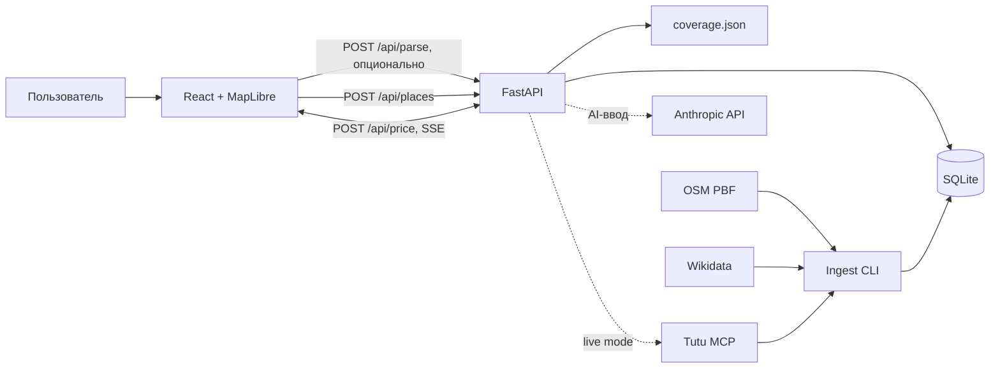

# Техническая документация «Бургера»

> Актуально для состояния проекта на 19 августа 2026 года. Документация описывает фактическую реализацию, а не только первоначальное ТЗ.

«Бургер» — веб-приложение для подбора путешествия по сочетанию интересов. Пользователь выбирает категории объектов и радиус, система находит подходящие группы мест, а затем строит и оценивает маршрут от города отправления.

## Карта документации

| Документ | Для чего |
|---|---|
| [Руководство пользователя](user-guide.md) | Как подобрать места, настроить поездку, получить цены и поделиться результатом |
| [Архитектура](architecture.md) | Компоненты, потоки, алгоритмы, структура исходников и архитектурные ограничения |
| [API](api.md) | HTTP-эндпоинты, запросы, ответы, SSE-события и ошибки |
| [Данные и ингест](data-and-ingest.md) | SQLite, идентификаторы, источники данных, конвейер наполнения и кэши |
| [Запуск и эксплуатация](operations.md) | Локальный запуск, Docker, конфигурация, тесты, диагностика и развертывание |

Исходные продуктовые материалы находятся в `mvp-spec.md`, `open-issues.md`, `risks.md` и `tutu-mcp-reference.md`. При расхождении источников приоритет у `schema.sql`, фактического кода и контрактов типов фронтенда.

## Технологический стек

| Слой | Технологии |
|---|---|
| Frontend | React 18, TypeScript 5.6, Vite 5, MapLibre GL |
| Backend | Python 3.12, FastAPI, Pydantic, Uvicorn |
| Хранилище | SQLite, JSON-файлы покрытия и справочников |
| Интеграции | Tutu MCP, Geofabrik/OpenStreetMap, Wikidata SPARQL, Anthropic API (опционально) |
| Доставка | Docker Compose, nginx 1.27 |
| Тестирование | `unittest`, FastAPI `TestClient`, frontend type-check/build |

## Система в одном рисунке

## Ключевая граница системы

Поиск мест и расчет поездки — две разные фазы:

1. `POST /api/places` работает локально по SQLite, не обращается к Tutu и должен отвечать быстро.
2. `POST /api/price` использует сохраненные данные и кэши, при включенном live-режиме обращается к Tutu и отдает результат постепенно через SSE.

Опциональный `POST /api/parse` находится перед первой фазой: он превращает свободный текст в категории и радиус. Его отказ не блокирует ручной выбор категорий.

## Текущее состояние и ограничения

- Снимок POI ограничен загруженными регионами; фактическое покрытие возвращает `GET /api/coverage`.
- По умолчанию live-запросы к Tutu выключены: цена строится из подтвержденных fixtures/кэша.
- Статус `live` для цены разрешается только после отдельного приемочного флага.
- Малые города могут быть `not_sellable`, но остаются в выдаче как варианты «дальше своим ходом».
- Ошибка резолвинга Tutu считается отдельным состоянием `misresolved`; такой результат нельзя трактовать как отсутствие маршрута.
- API не выполняет бронирование и оплату, а только возвращает ссылки оформления.
