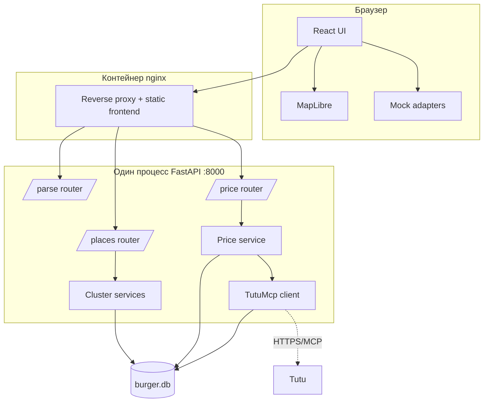
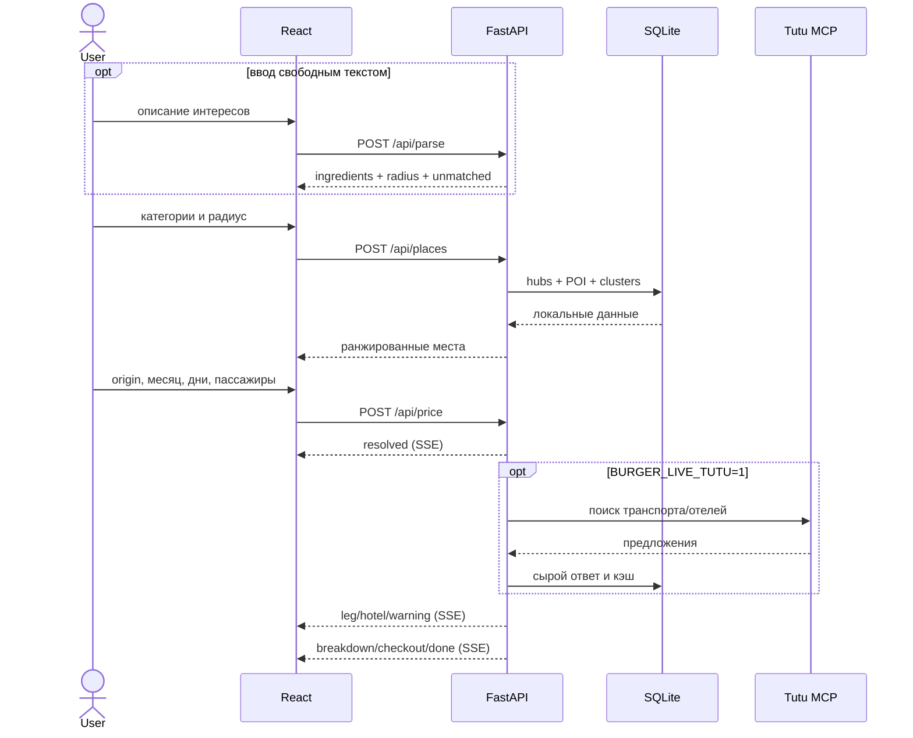
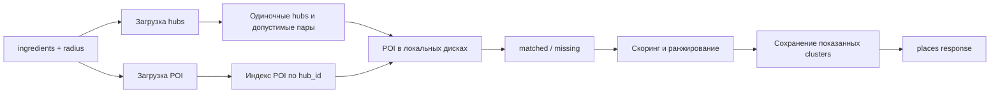

# Архитектура

## Контекст и ответственность компонентов



nginx маршрутизирует `/api/*`, `/healthz` и `/_sse_smoke` в backend, а остальные запросы — во frontend. Для SSE буферизация должна быть выключена.

## Основной пользовательский поток



## Backend

`backend/app.py` создает один FastAPI-процесс и подключает три роутера:

- `routers/places.py` — локальный поиск кластеров и метаданные покрытия;
- `routers/price.py` — потоковый расчет маршрута;
- `routers/parse.py` — необязательный AI-парсинг свободного текста.

Бизнес-логика вынесена в `backend/services`. Общие модели, схема и клиент Tutu находятся в `lib`. Доступ к SQLite выполняется напрямую через стандартный `sqlite3`; ORM намеренно отсутствует.

### Поиск мест

Кандидат — одиночный транспортный узел либо пара продаваемых узлов, расстояние между которыми не больше выбранного радиуса. POI присоединяются к дискам радиуса 25 км вокруг узлов. Это не DBSCAN: цепочка близких объектов не должна склеивать полрегиона.



Разрешены радиусы 50, 100 и 150 км. Идентичность кластера определяется только множеством hub ID и не меняется при смене радиуса. Фактический диаметр рассчитывается по POI; для больших наборов используется выпуклая оболочка.

Ранжирование учитывает полноту совпадения, продаваемость/достижимость, значимость объектов, диаметр и другие признаки. Неполные совпадения не удаляются: frontend показывает их в блоке «Почти подходит».

### Расчет цены

Роутер запускает синхронный генератор цены в отдельном daemon-thread и переносит события в async-ответ через очередь. При отключении клиента устанавливается cancel-флаг. Предельное ожидание завершения worker при закрытии — 60 секунд.

Источник цены выбирается по доступности:

1. live-вызов Tutu, если `BURGER_LIVE_TUTU=1`;
2. точный кэш по направлению, дате и составу пассажиров;
3. устаревший кэш как резерв с предупреждением;
4. событие `warning`, если цену восстановить нельзя.

Резолв каждого города проходит guard по ожидаемому названию и региону. Направление — свойство ребра `leg`, а не узла: наличие пути A → B не доказывает наличие B → A.

### AI-парсинг

`POST /api/parse` использует модель Anthropic только при наличии ключа. Ответ модели проходит JSON-разбор, валидацию категорий и приведение радиуса к допустимым значениям. Таймаут, сетевой сбой или некорректный ответ всегда превращаются в HTTP 200 с пустыми категориями и исходным текстом в `unmatched`.

## Frontend

Точка входа — `frontend/src/App.tsx`. API-адаптер поддерживает два режима:

- `live`: запросы к относительным `/api/*` через nginx;
- `mock`: локальные JSON и имитация SSE без backend.

Контракт собран в `frontend/src/types/contract.ts`. Поток SSE читается через Fetch Streams, потому что стандартный `EventSource` не поддерживает POST с JSON body. Карта отображает только именованные POI, хотя вычисления покрытия используют весь набор.

Основные компоненты: меню ингредиентов, форма origin, карта покрытия, карта кластера, список мест, карточка места, блок неполных совпадений, статус часов работы и поток цены. Состояние запроса может сериализоваться в ссылку для шаринга.

## Структура репозитория

```text
backend/             FastAPI, роутеры и сервисы
frontend/            React/Vite приложение и nginx static config
ingest/              CLI-этапы сбора и обогащения данных
lib/                 SQLite-модели, fixtures, клиент Tutu MCP
data/                справочники, coverage и рабочая burger.db
fixtures/            эталонные и резервные тестовые снимки
tests/               backend unit/integration/performance tests
nginx/               reverse proxy для compose
knowledge/invariants архитектурные инварианты
specs/, plans/        история решений и отчеты потоков разработки
schema.sql            источник истины схемы SQLite
ingredients.yaml      каталог категорий и правила классификации
```

## Архитектурные инварианты

- Фаза поиска мест не выполняет внешних сетевых запросов.
- Эталонные сценарии передают категории напрямую и не зависят от LLM.
- `schema.sql` — источник истины; SQLAlchemy-модели не добавляются.
- `probe_status` имеет три значения: `sellable`, `not_sellable`, `misresolved`.
- Продаваемость маршрута принадлежит направленному ребру.
- Пары узлов не должны отбрасываться как оптимизация до вычисления результата.
- Пустое покрытие вне загруженного снимка нельзя выдавать за отсутствие мест.
- Live-цена не объявляется подтвержденной без приемочного флага.

