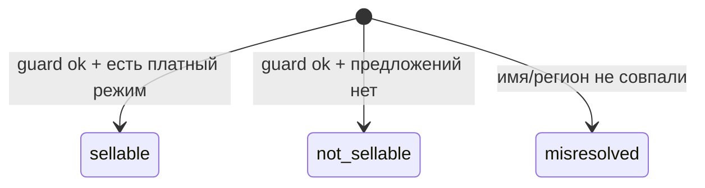

# Данные и ингест

## Источники

| Источник | Назначение | Способ получения |
|---|---|---|
| `data/cities_ru.json` | координаты и субъекты 1134 городов | локальный справочник |
| Tutu MCP | резолвинг, транспорт, цены, отели, checkout | HTTPS/MCP; не более 4 параллельных вызовов |
| Geofabrik OSM PBF | POI и административные признаки | загрузка PBF, локальный pyosmium |
| Wikidata | `P571`, подписи и классы | SPARQL, бережный последовательный режим |
| `ingredients.yaml` | правила OSM/Wikidata для категорий | версионируемая конфигурация |

## Схема потока данных

```mermaid
flowchart LR
  C[cities_ru.json] --> D1[D1 probe_hubs]
  T[Tutu MCP] --> D1
  D1 --> H[(hub)]
  H --> D2[D2 probe_legs]
  T --> D2
  D2 --> L[(leg)]
  G[Geofabrik PBF] --> D3[D3 parse_osm]
  H --> D3
  D3 --> P[(poi)]
  W[Wikidata SPARQL] --> D4[D4 enrich_wikidata]
  D4 --> P
  T --> D5[D5 warmup_cache]
  D5 --> RC[(route_cache)]
  D5 --> HC[(hotel_cache)]
  API[/api/places] --> CL[(cluster)]
```

## Таблицы SQLite

| Таблица | Назначение | Ключ |
|---|---|---|
| `hub` | город/транспортный узел, координаты, guard и результат проб | `id` |
| `poi` | объект интереса и классификация | `id` |
| `leg` | направленная транспортная связь | origin + dest + date |
| `cluster` | сохраненный результат группировки для радиуса | id + radius |
| `route_cache` | сырой/нормализованный ответ маршрута | origin + dest + date + adults + pax signature |
| `hotel_cache` | ответ по проживанию | hub + dates + adults + pax signature |
| `misresolve_log` | аудит ошибочного разрешения города | auto ID |
| `mcp_cache` | сырой ответ каждого MCP-вызова до бизнес-обработки | tool + hash arguments |

Схема создается и безопасно дополняется функцией `lib.models.connect()`. Миграционная логика расширяет идентичность кэшей составом пассажиров.

## Идентификаторы

```text
hub.id     = <name>|<subject>
cluster.id = c:<отсортированные hub.id через запятую>
pax_sig    = нормализованная сигнатура возрастов детей
```

Запятая запрещена внутри `hub.id`. Радиус не входит в публичный `cluster.id`: один набор узлов имеет один ID при 50/100/150 км, хотя строки предвычисления различаются составным ключом `(id, radius_km)`.

## Состояния узла и ребра



`sellable_modes` в `hub` — только снимок пробы Москва → город. Истина о конкретном направлении хранится в `leg.status`: `ok`, `no_route` или `misresolved`. Поле `reachable_from_any` вычисляется заново по существующим успешным ребрам.

## POI и классификация

OSM node и way преобразуются в POI; relation учитывается схемой, но текущий обработчик не создает из relation геометрию. Ways получают приближенный центроид по узлам. Категория выбирается по правилам `ingredients.yaml`, затем POI присоединяется к ближайшему hub:

- основной порог — 50 км;
- резервный порог — 150 км;
- дальше POI остается без `hub_id`.

Дата основания разбирается в интервал `start_date_from`/`start_date_to`. Статус часов имеет три значения: `open`, `closed`, `unknown`. Значимость учитывает Wikidata, Wikipedia, дату, имя и насыщенность тегами.

Wikidata сначала связывается по явному QID, затем — по координатам в пределах 100 м. Обогащение заполняет отсутствующую дату `P571`, но не должно затирать более конкретные OSM-данные.

## Guard и тихие отказы

Tutu может вернуть другой одноименный город без явной ошибки. После резолвинга нормализованные имя и регион сравниваются с ожидаемыми. Источник ожидаемого региона:

1. `cities_ru.subject`;
2. OSM `admin_level=4`, если города нет в справочнике;
3. `missing`, если определить регион нельзя.

Расхождение записывается в `misresolve_log`; такой узел сохраняется как `misresolved`, а предложение не используется. Отсутствующая цена (`0`, null или пустое поле) не считается бесплатным билетом.

## Запуск этапов

Все команды выполняются из корня репозитория с активным Python-окружением. Точные параметры доступны через `--help`:

```bash
python -m ingest.probe_hubs --help
python -m ingest.probe_legs --help
python -m ingest.parse_osm --help
python -m ingest.enrich_wikidata --help
python -m ingest.warmup_cache --help
```

Перед live-ингестом сделайте копию `data/burger.db`. D3 удаляет текущие строки `poi` перед вставкой нового снимка. D4 намеренно делает паузы между SPARQL-классами и может работать долго. D5 рассчитан на заданные окна октября 2026 года и составы в 1/2 взрослых; это демонстрационный прогрев, а не универсальный scheduler.

## Покрытие и воспроизводимость

`data/coverage.json` должен соответствовать тому же снимку, что и `burger.db`. Текущая реализация D3 ориентирована на PBF Ярославской области, а не на всю Россию. Пустая выдача вне `loaded` означает «данных нет в снимке», а не «объектов нет в реальности».

Fixtures дают воспроизводимый offline-режим и покрывают эталонный, резервный и ошибочные сценарии. Сырые ответы лежат в `fixtures/raw`; подготовленные строки таблиц — в `fixtures/rows`.

