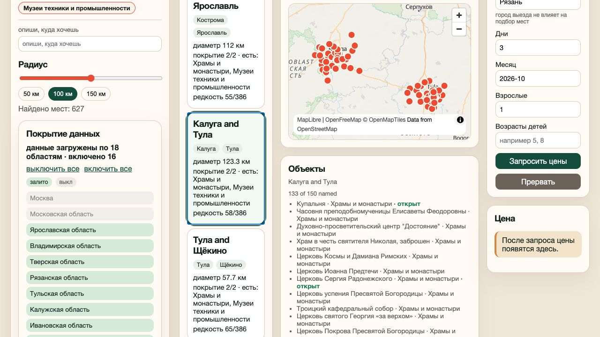
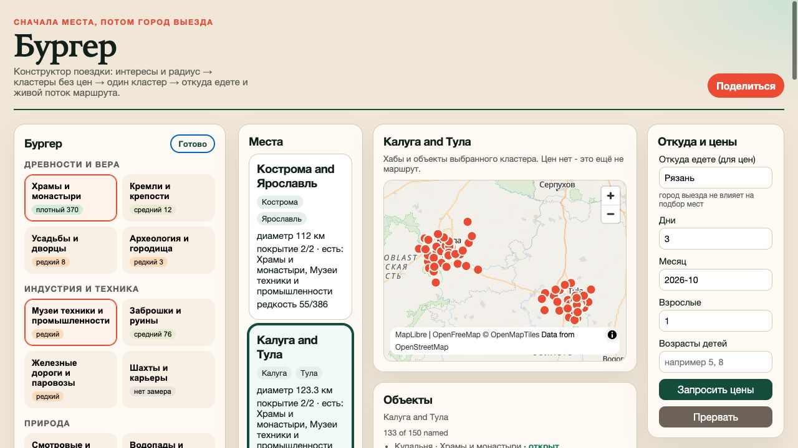
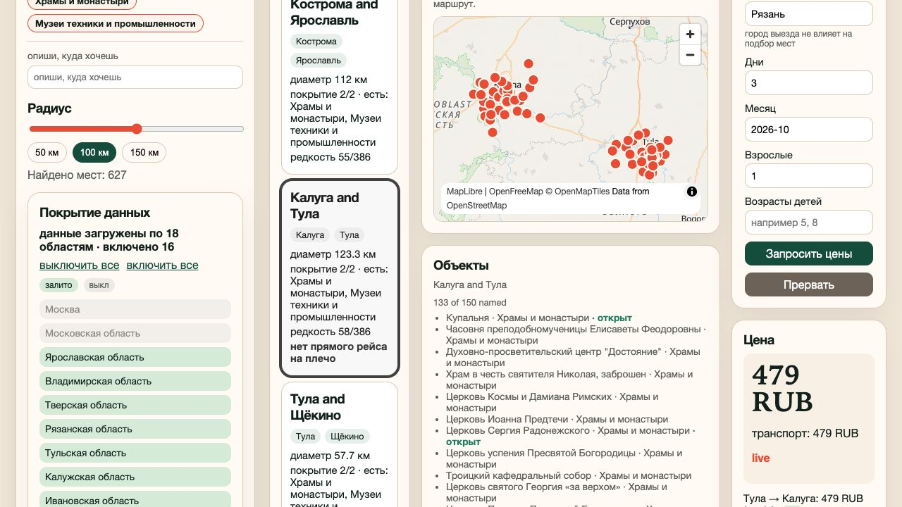

# Руководство пользователя «Бургера»

«Бургер» помогает выбрать направление, когда вы знаете, **что хотите увидеть**, но ещё не решили, **куда ехать**. Сначала сервис находит сочетания интересных мест, затем рассчитывает дорогу из вашего города.

> Руководство и снимки интерфейса актуальны на 19 августа 2026 года. Сервис использует снимок данных по ограниченному числу регионов; покрытие всегда показано в левой колонке.

## Быстрый старт

1. Выберите интересы — например, «Храмы и монастыри» и «Музеи техники и промышленности».
2. Установите радиус 50, 100 или 150 км.
3. Просмотрите найденные места и выберите карточку.
4. Проверьте объекты на карте и в списке.
5. Укажите город выезда, продолжительность, месяц и состав путешественников.
6. Нажмите **«Запросить цены»** и дождитесь итоговой суммы.
7. При наличии ссылок перейдите к покупке на Tutu или поделитесь текущей подборкой.

## 1. Выберите интересы

Нажмите **«Изменить»** в блоке «Бургер». Категории сгруппированы по темам: древности, индустрия, природа, культура, еда, покупки и активность.

Нажатие на категорию добавляет или удаляет её из подборки. После выбора нажмите **«Готово»**.

Рядом с категориями показана плотность данных:

| Метка | Что означает |
|---|---|
| `плотный` | объектов много, комбинацию найти проще |
| `средний` | объектов достаточно, но выбор уже |
| `редкий` | результатов может быть мало |
| `нет в регионе` | в текущем снимке таких объектов нет |
| `нет замера` | плотность пока не измерена |

Можно также описать желание в поле **«опиши, куда хочешь»**. Если AI-разбор доступен, сервис попробует подобрать категории автоматически. Проверьте результат вручную: свободный текст служит помощником, а не обязательным этапом.

## 2. Настройте радиус

Доступны три значения: **50, 100 и 150 км**. Радиус определяет допустимый географический размер подборки:

- 50 км — компактная поездка и меньше переездов;
- 100 км — сбалансированный вариант по умолчанию;
- 150 км — больше сочетаний, но длиннее перемещения между точками.

Счётчик «Найдено мест» показывает число подходящих вариантов в текущем снимке данных. При изменении интересов, радиуса или регионов выдача пересчитывается автоматически.

## 3. Учитывайте покрытие данных

Блок **«Покрытие данных»** показывает регионы, по которым загружены объекты. Нажмите на регион, чтобы включить или исключить его из поиска; ссылки **«выключить все»** и **«включить все»** управляют всем списком.

Пустая выдача за пределами загруженных регионов не означает, что интересных мест там нет: у сервиса может не быть данных для этой территории. Время снимка отображается внизу блока.

## 4. Выберите место

В колонке **«Места»** каждая карточка содержит:

- один или два города;
- фактический диаметр группы объектов;
- покрытие выбранных интересов;
- позицию по редкости комбинации.

`Покрытие 2/2` означает, что в подборке присутствуют обе выбранные категории. Карточки с неполным совпадением могут появляться как варианты «почти подходит».

Нажмите карточку, чтобы открыть её на карте. Красные точки — найденные именованные объекты. Под картой находится перечень объектов, их категории и, если данные известны, часы работы.

Обозначения часов:

- **открыт** — расписание удалось интерпретировать как открытое сейчас;
- **закрыт** — по расписанию объект закрыт;
- без статуса или **неизвестно** — данных недостаточно; проверьте официальный источник перед поездкой.

Количество объектов на карте может быть меньше числа объектов в расчёте: безымянные точки учитываются в покрытии, но не рисуются, чтобы карта оставалась читаемой.

## 5. Укажите параметры поездки

В блоке **«Откуда и цены»** заполните:

| Поле | Как заполнять |
|---|---|
| Откуда едете | название города отправления, например `Москва` |
| Дни | продолжительность поездки, минимум 1 день |
| Месяц | месяц поездки в формате `ГГГГ-ММ` |
| Взрослые | число взрослых путешественников |
| Возрасты детей | возраста через запятую, например `5, 8` |
| Бюджет | учитывать только транспорт или транспорт вместе с жильём |

Город выезда **не влияет на подбор мест**. Он используется только после выбора места — для проверки доступности маршрута и расчёта стоимости.

## 6. Получите маршрут и цену

Нажмите **«Запросить цены»**. Сервис показывает результат постепенно: сначала проверяет города, затем добавляет транспортные плечи, проживание, итог и ссылки покупки. Кнопка **«Прервать»** останавливает текущий расчёт.

В блоке цены отображаются:

- общая сумма;
- транспорт и жильё по отдельности;
- источник/статус цены;
- найденные плечи маршрута;
- предупреждения и ссылки **«Купить на Tutu»**.

Статус `live` означает, что цена получена живым запросом. `fixture-confirmed` означает подтверждённый демонстрационный или кэшированный результат. Цена может измениться на стороне продавца; сервис не бронирует и не списывает деньги.

Если отдельное плечо недоступно, карточка не обязана исчезнуть: сервис показывает причину и может предложить вариант «дальше своим ходом». Ошибка определения одноимённого города отображается отдельно и не считается обычным отсутствием билетов.

## 7. Поделитесь подборкой

Нажмите **«Поделиться»** в шапке. Ссылка сохраняет параметры текущей подборки, чтобы другой человек увидел те же интересы и настройки. Цены следует запросить заново: они зависят от времени и доступности.

## Частые вопросы

### Почему сначала выбираются места, а город отправления — позже?

Смысл сервиса — помочь решить, **куда поехать**, исходя из интересов. Город отправления нужен только для проверки дороги и цены, поэтому не ограничивает первую подборку.

### Почему результатов слишком много?

Уменьшите радиус, добавьте ещё один интерес или отключите часть регионов. Комбинация редких категорий, наоборот, может дать очень мало вариантов.

### Почему цена равна только стоимости транспорта?

Проверьте переключатель «Бюджет». В режиме «только транспорт» жильё не влияет на итог; в режиме «всё» сервис пытается добавить проживание, если оно найдено.

### Почему нет маршрута или цены?

Возможные причины: небольшой город не продаётся как транспортный узел, нет прямого плеча, внешний источник не ответил, данные устарели либо Tutu определил другой одноимённый город. Сообщение рядом с результатом уточняет причину.

### Можно ли купить поездку внутри сервиса?

Нет. «Бургер» подбирает варианты и передаёт на Tutu по ссылкам оформления. Бронирование и оплата происходят на стороне продавца.

## Ограничения и разумная проверка

- Покрытие не равно всей России — смотрите список загруженных регионов.
- Данные OpenStreetMap могут быть неполными или устаревшими.
- Часы работы, цены и наличие билетов проверяйте перед выездом.
- Итог строится по доступным прямым плечам и не гарантирует оптимальный сложный маршрут.
- Не воспринимайте значение 0 ₽ как бесплатный билет: отсутствие цены показывается как предупреждение.
